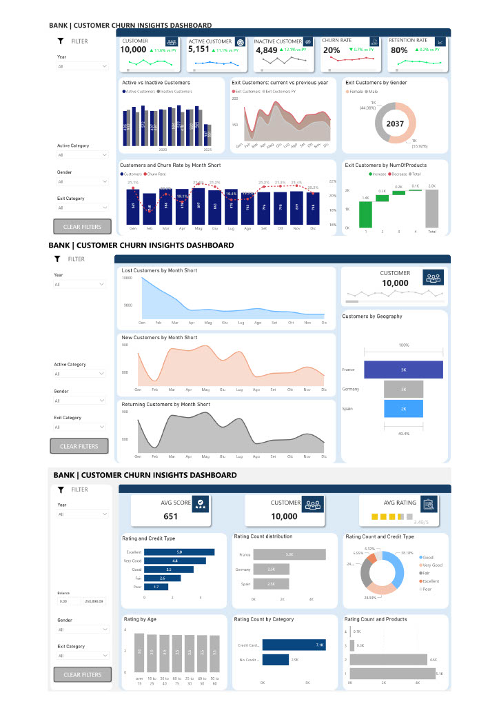

# Simo-s Portfolio

# [Project 1: Bank Customers Churn analysis]

**PROJECT OBJECTIVE**

Analyse the dataset Bank_Churn to get more informations about churn rate of customers and extracting also other useful KPI's.

**DATASET**

Bank_Churn csv from GCP Public Datasets

**ARCHITECTURE & PROCESS**

Back End Architecture - Google BigQuery:
- create a new project in BigQuery Sandbox ("Bank Customers Churn")
- then create a new dataset ("BankCustomers_dataset")
- load the CSV Bank_Churn into BigQuery
  
Front End Architecture - Power BI:
- PBI Desktop connected to BigQuery tables
- creation of the Dataset (Tables, structure star-schema, Relationships)

Cleaning data in SQL BigQuery:

- check for any null values (esclude those nulls)
- check for duplicated ID
- Use SQL to create a random date column (fictitious) and link it to a proper date table (for time-intelligence analysis)

Create 2 tables:
- Account Info
- Customers Info

Dashboard in Power BI:
- Create 2 report-pages to show Customer Churn Rate analysis & Lost customers, New customers, Returning customers (for 90 days).
- Create a report-page to display a customer Rating Analysis score based on Credit-score column (and also tootips to show 10 ranking customers Top by salary).

- The Project is published on ![live link to the project] (https://app.powerbi.com/view?r=eyJrIjoiZWM4OGU1ZmUtNjQ3Zi00ZmQzLWFiMmMtY2Q0ZDIxNjgxNjM2IiwidCI6ImViMTY4ZjAxLWI0ZWEtNDFjNi05YzgyLWM3MzgxNmNhMDViNSIsImMiOjh9)

## Dashboard Bank Customer Analysis

