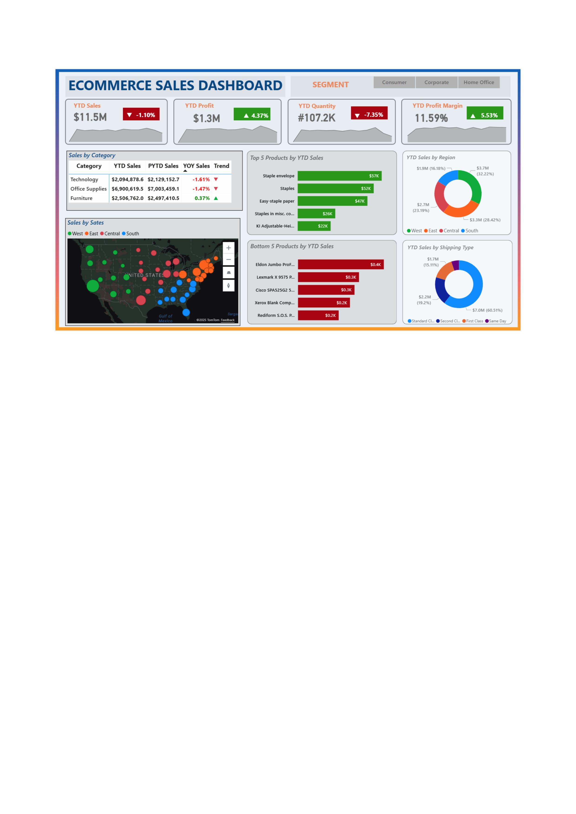
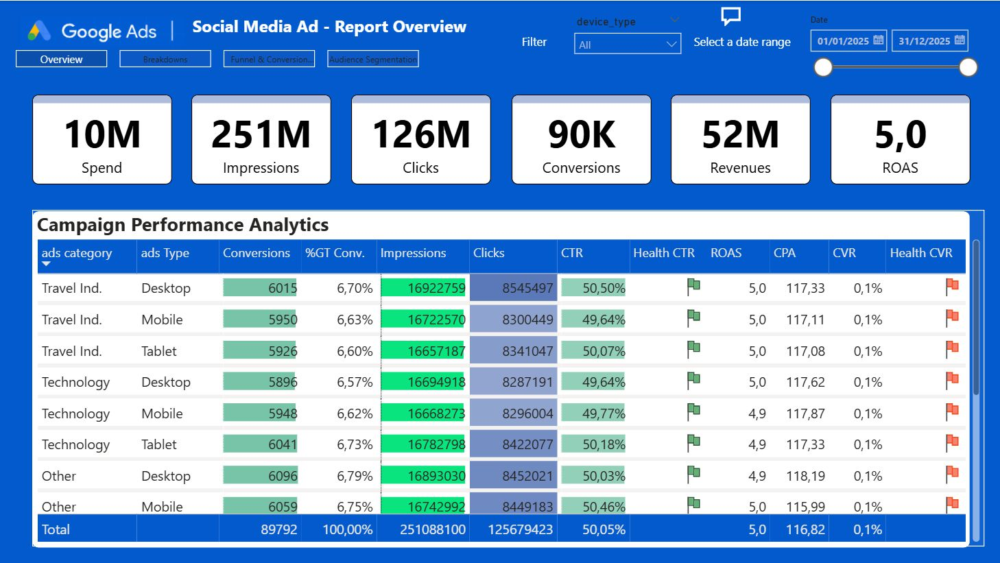
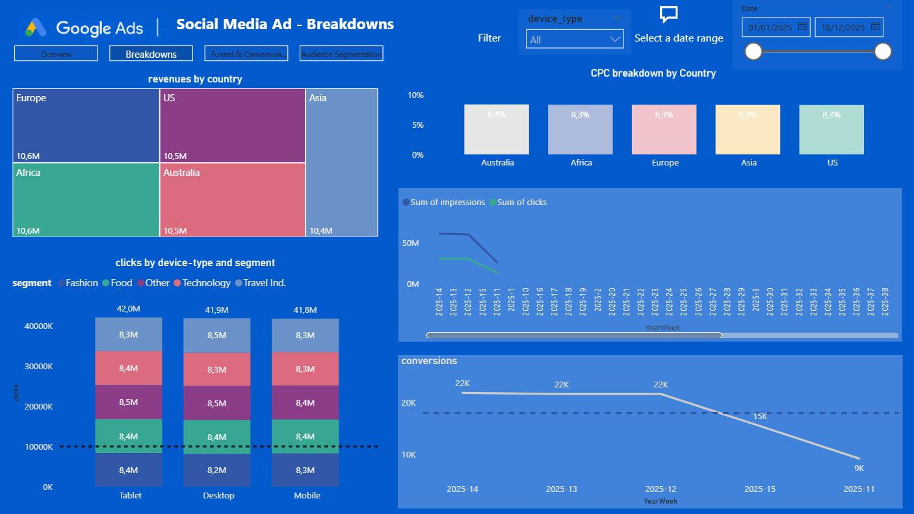
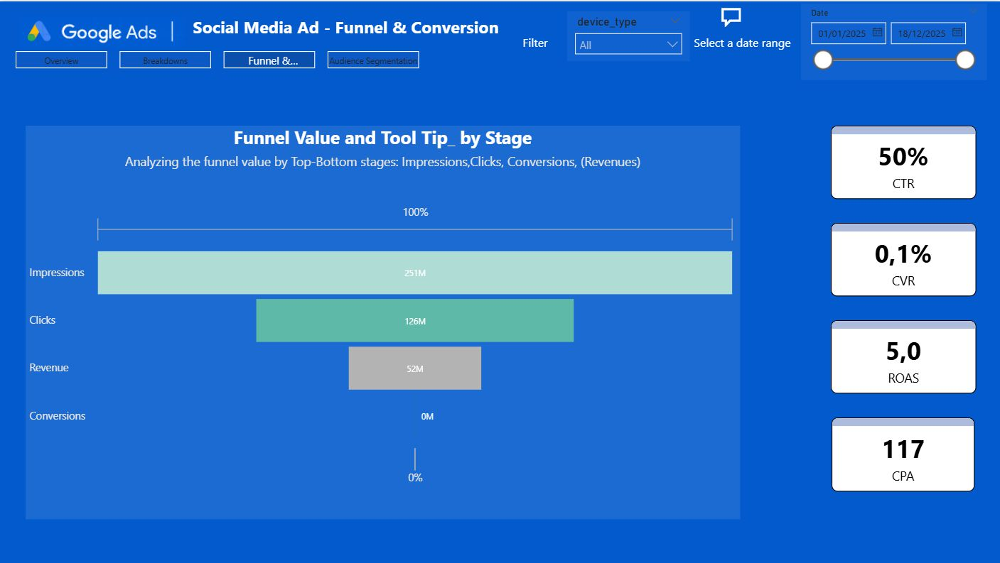
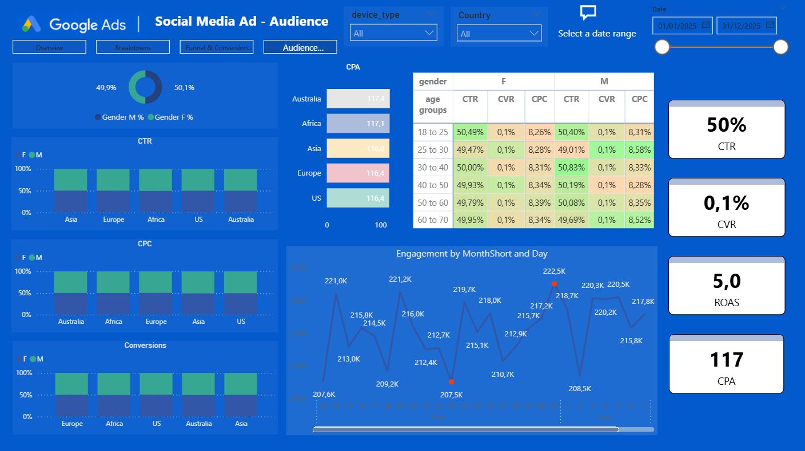

# Simo-s Portfolio

# **Project 1: Bank Customers Churn analysis**

**PROJECT OBJECTIVE**
Analyse the dataset Bank_Churn to get more informations about churn rate of customers and extracting also other useful KPI's.

**DATASET**
Bank_Churn csv from Kaggle

**ARCHITECTURE & PROCESS**
Back End Architecture - Google BigQuery:
- create a new project in BigQuery Sandbox ("Bank Customers Churn")
- then create a new dataset ("BankCustomers_dataset")
- load the CSV Bank_Churn into BigQuery
  
Front End Architecture - Power BI:
- PBI Desktop connected to BigQuery tables
- creation of the Dataset (Tables, structure star-schema, Relationships)

Cleaning data in SQL BigQuery:
- check for any null values (esclude those nulls)
- check for duplicated ID
- Use SQL to create a random date column (fictitious) and link it to a proper date table (for time-intelligence analysis)

Dashboard in Power BI:
- Create 2 report-pages to show Customer Churn Rate analysis & Lost customers, New customers, Returning customers (for 90 days).
- Create a report-page to display a customer Rating Analysis score based on Credit-score column (and also tootips to show 10 ranking customers Top by salary).

- The Project is published on ![https://app.powerbi.com/view?r=eyJrIjoiZWM4OGU1ZmUtNjQ3Zi00ZmQzLWFiMmMtY2Q0ZDIxNjgxNjM2IiwidCI6ImViMTY4ZjAxLWI0ZWEtNDFjNi05YzgyLWM3MzgxNmNhMDViNSIsImMiOjh9]

## Dashboard Bank Customer Analysis

# **Project 2: Dashboard Ecommerce Sales Insights Analysis**

**PROJECT OVERVIEW**
This project offers an in-depth analysis of an e-commerce enterprise leveraging **Power BI**. Key business metrics and trends are visualized through a comprehensive dashboard. The insights derived facilitate data-driven decision-making, aiding business growth.
The goal of this project is to provide actionable insights into the e-commerce landscape, highlighting areas for enhancement and growth.

**DATASET**
Ecommerce_data csv,  Longitude&Latitude_data

**PROCESS**
Cleaning, transforming and analizing data using:
* Microsoft Power BI
* Power Query
* DAX Query

Creation of an interactive dashboard for online sales data with various visualization types used: **bar chart, pie chart, donut chart, clustered bar chart, line chart, area chart, map, slicers, etc.**

The dashboard in Power BI displays:

>**Key Performance Indicators** as Total Profit, Total Sales, Total Quantity, Profit Margin%

>**Monthly Trends:** Sales & Profit

>**Category-wise Analysis:** Profits, Sales, and Sales%

>**Sales by Geography:** States and Regions

>**Top & Bottom 5 Products Analysis**

>**Regoinal Sales Analysis**

The Project is published on ![https://app.powerbi.com/view?r=eyJrIjoiNjVjNDk5NGMtMWI5Yi00ODI1LThiYWMtNDMyMWZjOGQ4NTkyIiwidCI6ImViMTY4ZjAxLWI0ZWEtNDFjNi05YzgyLWM3MzgxNmNhMDViNSIsImMiOjh9]

## Dashboard Ecommerce Sales Insights Analysis

# **Project 3: Social Media Ad dashboard**

**PROJECT OBJECTIVE**
This dashboard aims is to analyze online Social media ads data.
Using **Power BI tool** to injest, clean and analyze data.
Showing KPI's on various aspects, such as:

- demographics (audience segmentation) 
- breakdowns of revenues, clicks, impressions, conversions
- funnel & conversions jorney analysis

Advanced visualization techniques:
Stacked column and bar chart, Treemap chart,Line chart, Matrix & Table, Cards, Funnel chart and Q&A functionalities.

**Dataset**
Link to Kaggle Dataset: https://www.kaggle.com/datasets/ziya07/social-media-ad-engagement-dataset

The Project is published on ![https://app.powerbi.com/view?r=eyJrIjoiMzMyYzY2MTEtODk1OC00OTY0LTg2OTAtYmJiYzBkNzExNTk4IiwidCI6ImViMTY4ZjAxLWI0ZWEtNDFjNi05YzgyLWM3MzgxNmNhMDViNSIsImMiOjh9]

## Dashboard Social Media Ads

# **Project 4: Dashboard Supply Chain Analytics**

**PROJECT OVERVIEW**
This project focuses on creating a Make versus Buy comparison analysis tool using **Power BI**. 
The solution of this project will go through the development of various techniques:

- a quotes analysis tool

- the breakdown of costs for various production volumes (scenario analysis for Buy/Make)

- the integration of internal manufacturing cost data for in-depth analysis

- the use of advanced analysis & visualization techniques (charts, matrix, tables, parameters, dymanic text boxes, interactive tooltips and drill-through)

**Purpose & Application**

>The project initially goes through the analysis of external quotes, to find the best-choice supplier and what-if scenario.

>Then the analysis move towards internal production estimate data, calculating additional capacity and investment requirements.

>The final part is more focused on the comparison of the two methodologies (Make vs Buy), cost savings and quality control.

**Source Dataset** 
//Datacamp. 
Serve as a training dataset for supply chain analysis models.
The dataset has been synthetically generated and do not represent real data.

The Project is published on ![https://app.powerbi.com/reportEmbed?reportId=373e574a-2e6e-440e-966e-510b8c667b8b&autoAuth=true&ctid=eb168f01-b4ea-41c6-9c82-c73816ca05b5]

## Dashboard Supply Chain Analytics

